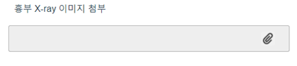
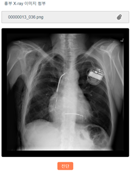
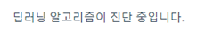
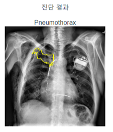

# Web Service and Deep Learning-Based Explanation Algorithm for Differential Diagnosis on Chest X-Ray Images

## Introduction

This system uses a deep learning algorithm to analyze chest X-rays to make a diagnosis 
and to visually show the rationale for making such a diagnosis through explainable artificial intelligence(XAI) 
to assist the reading doctor.

## How to run

### Project setup
```
npm install
```

### Run vue.js server
```
npm run serve
```

### Run node.js server
```
npm start
```

### Download model weight
https://drive.google.com/file/d/1-rGWSM2ucp6EHWfCJgZqMzsTrrTHa6LD/view?usp=sharing

Download the file and put it in the ```model/``` path.

### Enter to web
http://localhost:8080

## Execution sample



If you run the web server and enter to it, you will see a screen like the screenshot above.
You can upload an X-ray image by clicking the attachment icon on the screen.



When you upload a photo, the uploaded image is displayed as shown in the screenshot above, 
and the diagnostic button appears. The uploaded image is a chest X-ray image of a patient 
diagnosed with pneumothorax.



When you click the diagnosis button, the text stating that it is being diagnosed is displayed 
as shown in the screenshot above. During this time, the server will analyze the photos through 
a Python script.



After waiting for a while, if fetches and displays the diagnostic results from the server.
As shown in the screenshot above, the area of evidence is found and displayed in the image
along with the diagnosis name.